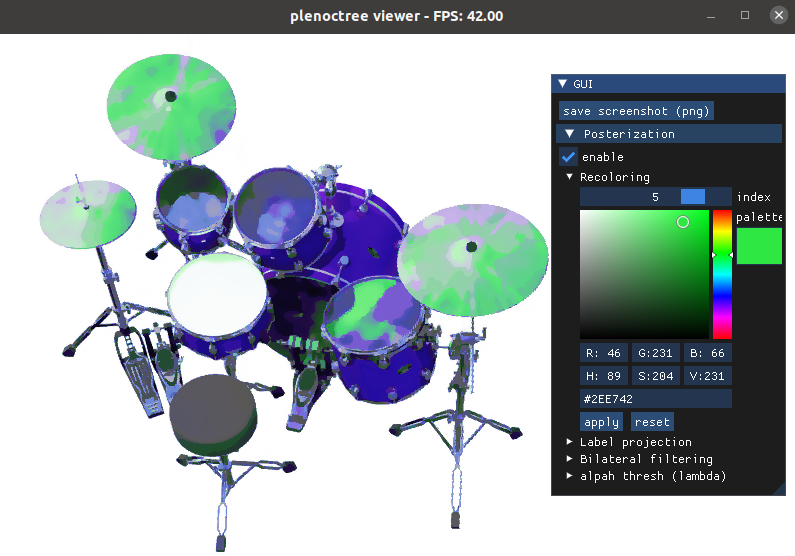

# Recolorable Posterization of Volumetric Radiance Fields



This is the official code release for the paper:

**Recolorable Posterization of Volumetric Radiance Fields Using Visibility-Weighted Palette Extraction**\
[Kenji Tojo](https://kenji-tojo.github.io/) and [Nobuyuki Umetani](https://cgenglab.github.io/labpage/en/authors/admin/)\
In Eurographics Symposium on Rendering (EGSR) 2022\
**[[Project page](https://kenji-tojo.github.io/publications/posternerf/)]**

## Code structure

`rgbsg` contains the RGB-space convex hull analysis for palette extraction.

`plenoctree` contains the C++/CUDA library for radiance sampling, sample filtering, and stylized rendering.

For details, see the README.md under these directories.

## Installation

Clone this repository recursively
```
git clone --recursive https://github.com/kenji-tojo/posternerf.git
```


## Requirements

C++17, CUDA, and Python.\
We tested on CUDA 11.4 and Python 3.8.

Please also setup the Python dependencies through
```
conda create -n posternerf python=3.8
conda activate posternerf
pip install --upgrade pip
pip install -r ./requirements.txt
```


## Building

Please build the C++/CUDA library under `plenoctree` to run this demo.

### Linux
```
mkdir build && cd build
cmake ..
make -j9
```
### Windows
```
mkdir build && cd build
cmake .. -G "Visual Studio 16 2019"
cmake --build . --config Release
```


## Data
Our method takes a pre-trained PlenOctree model as input.

To be self-contained, we release the models used in our experimetns [here](https://drive.google.com/drive/folders/1qABfv_qaqWxY1Zc32lQcFz9pEFZlIUBe?usp=sharing).\
The original data can be found [here](https://github.com/sxyu/volrend#precomputed-plenoctree-files).

You may put these resource files under the directory named `data`. Git will ignore them.

## Palette extraction
Run the palette extraction via
```
python palette_extraction.py data/<model_name>.npz
```
The output will be saved to the `output/<model_name>` directory.

Or, you may download the palettes computed on our machine [here](https://drive.google.com/drive/folders/1agyKlx-vk0tM2OCgMMpZiJ9lw9PkJh91?usp=sharing).

## Stylized rendering
To launch our run-time posterization and recoloring demo, run
```
python viewer.py data/<model_name>.npz --palette output/<model_name>/palette.npz
```
Please use the GUI to controll the stylization, such as enabling/disabiling the posteriation and performing recoloring.
